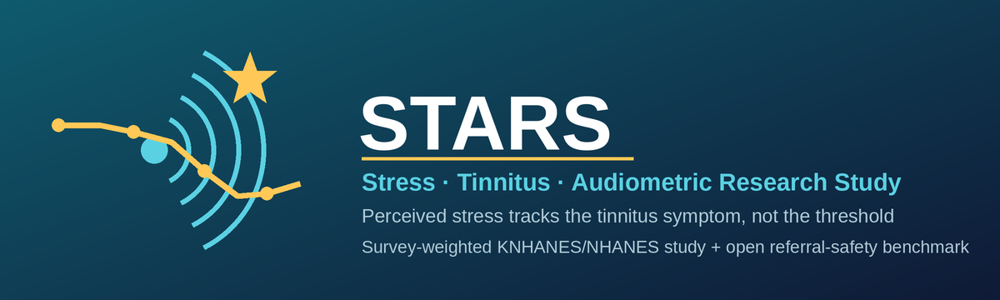

  

# STARS

**STARS** = **S**tress, **T**innitus, and **A**udiometric **R**esearch **S**tudy.

An *American Journal of Audiology*–targeted **survey-weighted research study** on
the associations among perceived stress / work-related factors, tinnitus, and
hearing outcomes, using public survey data. Its primary finding (real KNHANES,
adults 40–69): perceived stress tracks the tinnitus *symptom* (OR 1.42) but not
the audiometric *threshold* (OR 1.18, ns) once occupational noise and age are
accounted for, with NHANES as directional support. A prespecified plan for
prospective components — cross-national validation and a clinician-governed,
safety-gated AI/referral component — is specified but carries no results.
Perceived stress is treated as *associated* with — not a proven cause of —
tinnitus/hearing outcomes.

Repository: <https://github.com/leemgs/stars-audiology>

## Two papers

This repository holds **two companion manuscripts**:

- **Paper A — STARS** (`paper/`, targeted at *American Journal of Audiology*): the
  empirical, survey-weighted finding above, with the AI/safety component demoted
  to a prospective plan (no results).
- **Paper B — SAFE-EAR** (`paper02/`, targeted at a medical-informatics venue):
  develops that AI/safety component **with real results** — a deterministic,
  guideline-derived referral-safety layer over open-LLM extraction, evaluated on
  an open 71-case benchmark (no patient data). Rule coverage is 100%; end-to-end
  safety is bounded by extraction, and the benchmark *discriminates* it (red-flag
  recall 56% → 100% across a naive vs. an improved extractor). An actual MedGemma
  evaluation is prospective; the benchmark and metrics are fixed as a prespecified
  reference.

### Paper A vs. Paper B at a glance

| | **Paper A — STARS** | **Paper B — SAFE-EAR** |
|---|---|---|
| **Question** | *Is perceived stress associated with the tinnitus symptom vs. the audiometric threshold?* | *Can a deterministic safety layer keep LLM-assisted otology triage safe, and what bounds it?* |
| **Type** | Empirical epidemiology (observational) | Safety engineering + open benchmark (methods) |
| **Data** | Real public survey microdata (KNHANES/NHANES, adults 40–69) | 71-case referral benchmark, expert-authored/synthetic — **no patient data** |
| **Method** | Survey-weighted, design-based regression | Guideline-derived deterministic red-flag rules + rule-based extraction + evaluation harness |
| **Headline result** | Perceived stress → **tinnitus OR 1.42** (p<0.001) but **threshold OR 1.18** (ns): a symptom-vs-threshold dissociation | Rule coverage **100%**; end-to-end recall **56% → 100%** across a naive vs. improved extractor → **extraction is the safety bottleneck** |
| **Role of AI** | None in the result; AI/safety is a *prospective plan* (appendix) | AI/LLM extraction **is the subject**; MedGemma eval prospective, benchmark fixed as reference |
| **Target venue** | *American Journal of Audiology* (SCIE; free via subscription route) | *Journal of the American Medical Informatics Association* — JAMIA (SCIE; free via subscription route) |
| **Relationship** | The primary finding + clinical motivation | Develops STARS's prospective safety component **with results** |

**In one line:** *Paper A* asks a clinical-epidemiology question on real survey data (what stress is associated with); *Paper B* asks a safety-engineering question on an open benchmark (whether AI-assisted referral can be made safe, and where it fails). They are complementary, not overlapping.

| Folder | What it contains |
|--------|------------------|
| `paper/`   | **Paper A (STARS)** — LaTeX manuscript (source sections, bibliography, tables, figures) and the compiled PDF: the empirical stress–tinnitus–threshold survey study. |
| `paper02/` | **Paper B (SAFE-EAR)** — LaTeX manuscript, auto-generated result tables, result JSONs, and compiled PDF: the deterministic referral-safety layer and open benchmark, with real results. |
| `code/`    | Reproducible pipeline shared by both papers: survey-weighted NHANES/KNHANES analysis (Paper A) and the red-flag safety layer, open benchmark, rule-based extractors, and evaluation harness (Paper B), with tests. |
| `ppt/`     | English and Korean presentation decks (`pptxgenjs` source scripts + built `.pptx`). |
